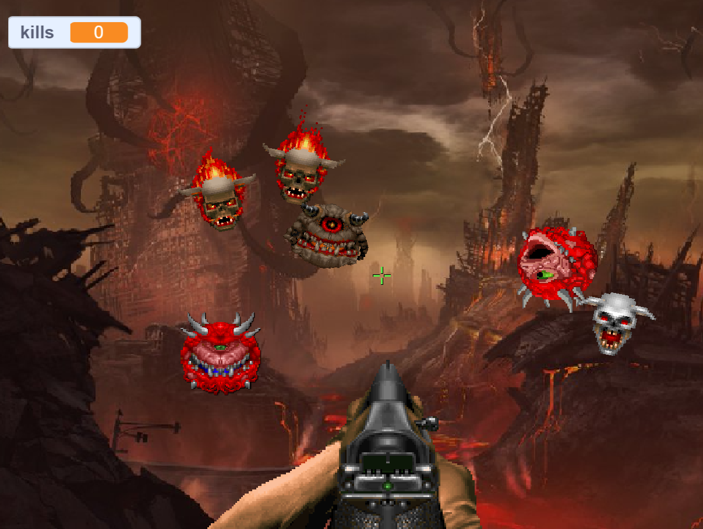

# Doom Scratch

## What is this?

This is a scratch minigame based on Doom 1993 that I made as an assignment of the cs50 first class [Week 0](https://cs50.harvard.edu/x/2021/weeks/0/) - [Scratch](https://cs50.harvard.edu/x/2021/psets/0/scratch/).

## How to play the game?

Wanna play the game? Just download the gamefile [here](https://github.com/rodrigosuelli/cs50/week0/pset0/scratch/raw/master/gamefile.sb3) then open the scratch editor [page](https://scratch.mit.edu/projects/editor/), then open the File tab -> Load from your computer -> Select the game file on your file explorer -> Put the game in full screen mode and click the Green Flag to play. Just shoot all the enemies until you get bored. Hope you have fun playing it.
